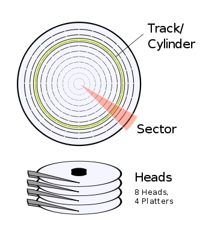
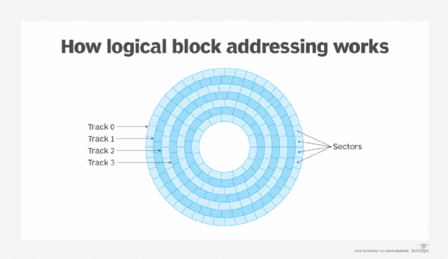
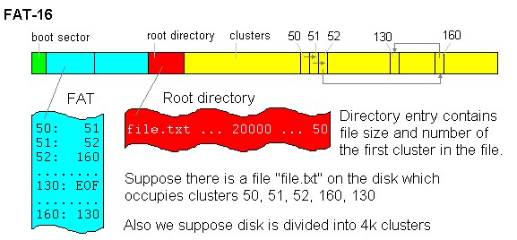

# 32Bit_OS
-> BIOS
-> Boot Loader
-> Kernel
-> Init
-> C Program

Date : 29 Dec 2025
**Programmable Inturrupt Controller(PIC) :**
Check out : https://wiki.osdev.org/8259_PIC

Date : 30 Dec 2025
# Heap Implementation

Memory Pool : 
Start Address :
Block Size : 
Block Address :

Date : 31 Dec 2025
# Paging

Visit : [text](https://wiki.osdev.org/Paging)

Date : 04.01.2026
**LBA -> Logical Block Addressing**

Date : 05.01.2026
# File System
FAT16 -> File Allocation Table

Date: 06.01.2025
# File Allocation Table

Date : 07.01.2025
# FAT16 File System

## FAT16 Boot Sector Structure

| Offset | Size | Field                     |
| ------ | ---- | ------------------------- |
| 0x00   | 3    | Jump Instruction          |
| 0x03   | 8    | OEM Name                  |
| 0x0B   | 2    | Bytes per sector          |
| 0x0D   | 1    | Sectors per cluster       |
| 0x0E   | 2    | Reserved sectors          |
| 0x10   | 1    | Number of FATs            |
| 0x11   | 2    | Root entries              |
| 0x16   | 2    | Sectors per FAT           |
| 0x24   | 1    | Drive number              |
| 0x26   | 1    | Boot signature            |
| 0x27   | 4    | Volume ID                 |
| 0x2B   | 11   | Volume Label              |
| 0x36   | 8    | Filesystem Type ("FAT16") |
| 0x1FE  | 2    | Boot signature `0x55AA`   |

## FAT16 Cluster States

| Value         | Meaning     |
| ------------- | ----------- |
| 0x0000        | Free        |
| 0x0002–0xFFEF | Used        |
| 0xFFF7        | Bad cluster |
| 0xFFF8–0xFFFF | End of file |
