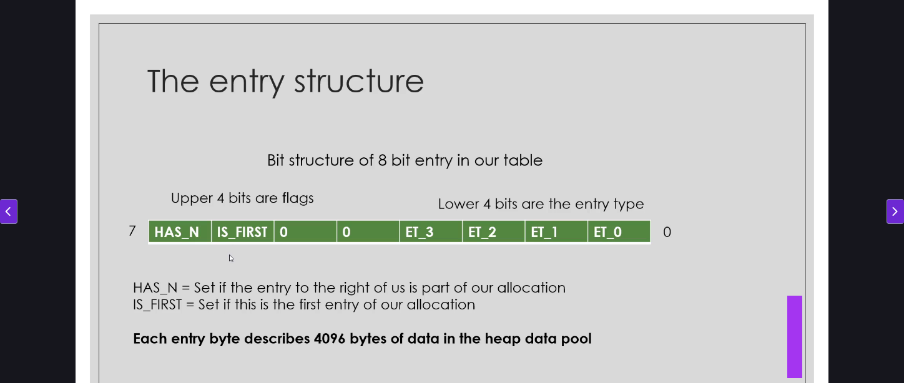
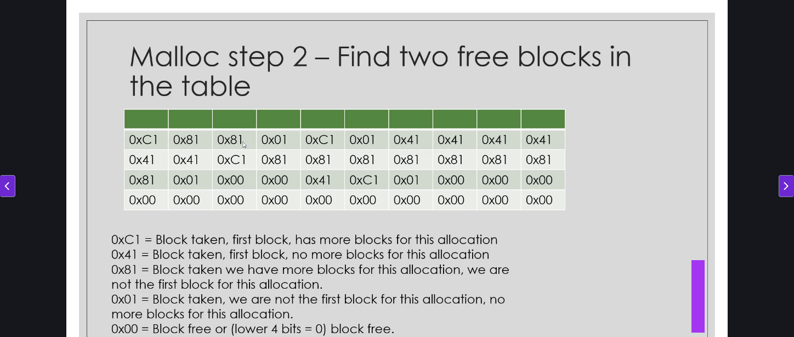
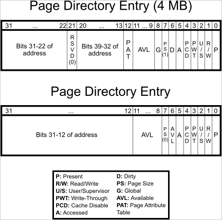
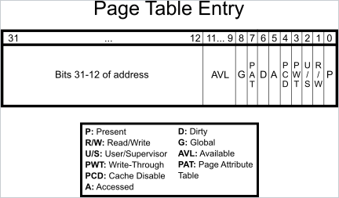

# 32Bit_OS
-> BIOS
-> Boot Loader
-> Kernel
-> Init
-> C Program

Date : 29 Dec 2025
**Programmable Inturrupt Controller(PIC) :**
Check out : https://wiki.osdev.org/8259_PIC

Date : 30 Dec 2025
# Heap Implementation

Memory Pool : 
Start Address :
Block Size : 
Block Address :

Date : 31 Dec 2025
# Paging

Visit : [text](https://wiki.osdev.org/Paging)

